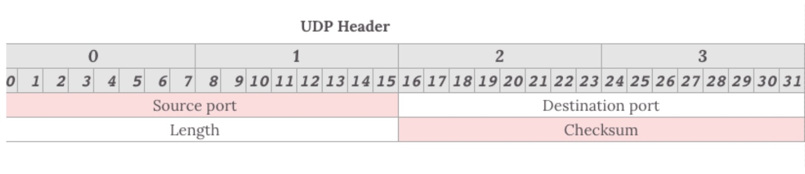
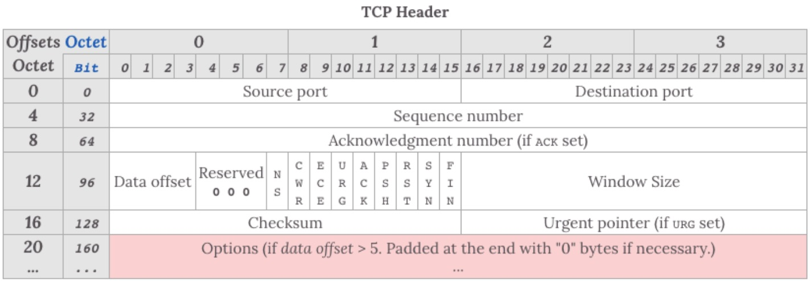
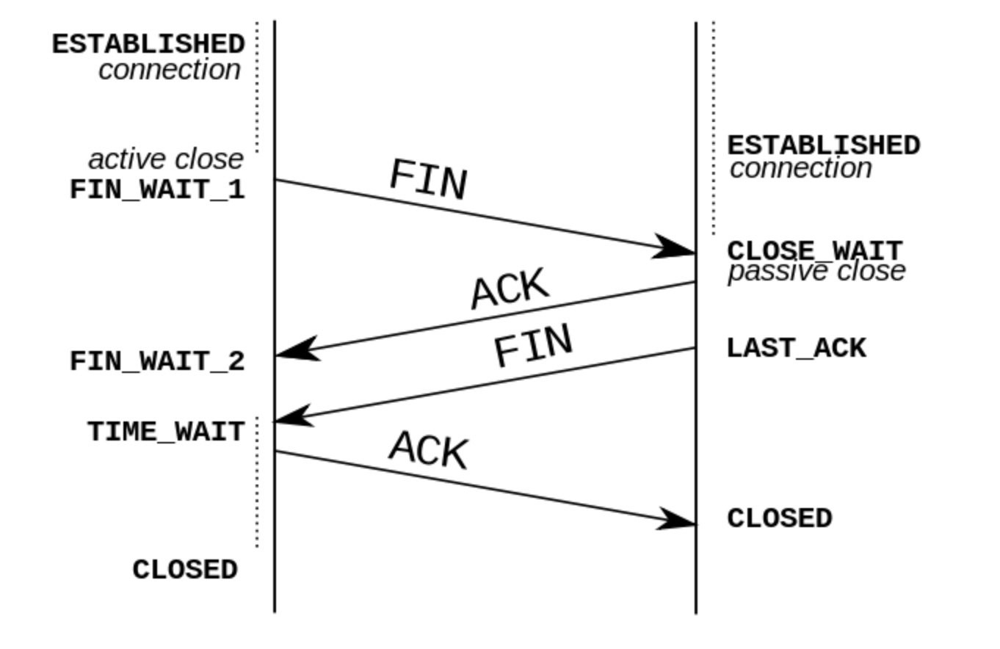
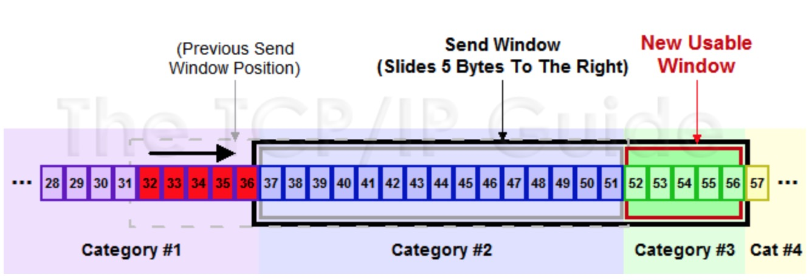

## damn hole of network

### OSI七层协议

应用层、表示层、会话层、传输层、网络层、数据链路层、物理层

### TCP/IP四层体系

应用层（各种应用层协议，如TELNET、FTP、SMTP）、传输层（TCP、UDP）、网际层（IP）、网络接口层

### 五层协议体系

应用层、传输层、网络层、数据链层、物理层

### UDP

**面向报文**

UDP是一个面向报文的协议。即只是报文的搬运工，不会对报文进行任何拆分和拼接操作

- 在发送端，应用层将数据传递给传输层的 UDP 协议，UDP 只会给数据增加一个 UDP 头标识下是 UDP 协议，然后就传递给网络层了
- 在接收端，网络层将数据传递给传输层，UDP 只去除 IP 报文头就传递给应用层，不会任何拼接操作

**不可靠性**

1. 无连接的，通信是不需要建立和断开连接
2. 不可靠的，协议收到什么数据就传递什么数据，不关系对方是否能收到
3. 没有拥塞控制，一直会以恒定的速度发送数据。弊端在网络条件不好的情况下会导致丢包，好处对实时性要求高的场景（比如电话会议）使用更好

**高效**



UDP没有TCP复杂，不需要保证数据不丢失且有序到达。所以UDP的头部开销小，只有八个字节，在传输数据报文时是高效的

头部包含以下几个数据

- 两个十六位的端口号，分别为源端口Source port（可选字段）和目标端口Destination port
- 整个数据报文的长度Length
- 整个数据报文的检验和（IPV4可选字段），该字段用于发现头部信息和数据中的数据

传输方式

支持一对一，一对多，多对多，多对一，即支持单播，多播，广播的功能

### TCP



- Sequence number，保证TCP传输的报文都是有序的，对端可以通过序号顺序的拼接报文

- Acknowledgement Number，表示数据接收端期望接收的下一个字节的编号是多少，同事表示上一个序号的数据已经收到

- 标识符

  URG=1：表示本数据报的数据部分包含紧急信息，是一个高优先级报文，此时紧急指针有效。紧急数据一定位于当前数据包数据部分的最前面，紧急指针标明了紧急数据的尾部

  ACK=1：表示确认号字段有效。TCP规定在连接建立后传送的所有报文段都必须把ACK置为1

  PSH=1：表示接收端应该立刻将数据push给应用层，而不是等缓冲区满了再提交

  RST=1：表示当前TCP连接出现严重问题，可能需要重新建立TCP连接，也可以用于拒绝非法的报文段和拒绝连接请求

  SYN=1：SYN=1，ACK=0时，表示报文段是一个连接请求报文；SYN=1，ACK=1，表示报文段是一个同意建立连接的应答报文

  FIN=1：表示报文段是一个释放连接的请求报文

#### 状态机

HTTP是无连接，所以下层的TCP也是无连接的，只是两端共同维护状态

##### 建立连接三次握手


主动发起端称为客户端，被动连接端称为服务端。不管是客户端还是服务端，TCP连接建立后都能发送和接受数据，所以TCP是一个**全双工**的协议

**起初**

两端都是CLOSED状态，通信开始前，都会创建TCB。服务端创建完TCB后便进入到LISTEN状态，等待客户端发送数据

**第一次握手**

客户端向服务端发送连接请求报文段。报文段中包含自身的数据通讯初始序号。请求发送后，客户端进入SYN-SENT状态

**第二次握手**

服务端收到连接请求报文段后，同意连接就会发送一个应答，应答包含自身的数据通讯初始序号，发送完进入SYN-RECEIVE状态

**第三次握手**

当客户端收到连接同意的应答后，向服务端发送一个确认报文。客户端发完便进入ESTABLISHED状态，服务端收到也进入ESTABLISHED状态，连接建立成功

**第三次握手可以包含数据，通过TCP快速打开（TFO）技术，客户端和服务端存储相同cookie，下次握手时发出cookie达到减少RTT的目的**

##### 断开连接四次握手



在断开连接时两端都需要发送FIN和ACK

**第一次握手**

客户端任务数据发送完成，需要向服务端发送连接释放请求

**第二次握手**

服务端收到连接释放请求后，会告诉应用层要释放TCP链接。然后会发送ACK，并进入CLOSE_WAIT状态，表示客户端到服务端的链接已经释放，不接受客户端的数据了。

**第三次握手**

服务端此时还没有发完的数据会继续发送，完毕后会向客户端发送连接释放请求，服务端便进入LAST_ACK状态

**第四次握手**

客户端收到释放请求后，向服务端发送确认应答，此时客户端进入TIME_WAIT状态。该状态会持续2MSL(最大段生存期，指报文段在网络中生存的时间，超时会被抛弃)时间，若该时间段内没有服务端的重发请求，就进入CLOSE状态。当服务端收到确认应答后，也进入CLOSE状态

##### ARQ协议

超时重传机制。通过确认和超时机制保证数据的正确送达，ARQ协议包含停止等待ARQ和连续ARQ

###### 停止等待ARQ

这个协议的缺点是传输效率低，在良好的网络环境下每次发送报文都得等待对端的ACK

###### 连续ARQ

发送端拥有一个**发送窗口**，在没有收到应答的情况下持续发送窗口内的数据，相比停止等待ARQ协议来说减少了等待时间，提高效率

连续ARQ中，接收端会持续不断收到报文。通过**累计确认**，可以在收到多个报文以后统一回复一个应答报文。报文中的ACK可以用来告诉发送端这个序号之前的数据已经全部接受到了，下次请发送这个序号+1的数据

累计确认会存在问题。在连续接收报文时，可能会遇到收到序号5，未接受到序号6，然而序号7以后的报文已经接收。遇到这种情况，ACK会回复6，导致7重复发送，这种情况可以通过**Sack**来解决。

###### 滑动窗口（流量控制）

两端都维护窗口：发送端窗口和接收端窗口

发送端窗口是由接收端窗口剩余大小决定的。接收方会把当前接收窗口的剩余大小写入应答报文，发送端收到应答后根据该值和网络拥塞情况设置发送窗口的大小，所以发送窗口的大小是不断变化的


当发送端接收到应答报文后，会将窗口进行滑动



**滑动窗口实现了流量控制**。接收方通过报文告知发送方还可以发送多少数据，从而保证接收方能够来得及接收数据

**zero窗口**

在发送报文的过程中，可能会遇到对端出现零窗口的情况。发送端会停止发送数据，并启动persistent timer。该定时器会定时发送请求给对端，让对端告知窗口大小。在重试次数超过一定次数后，可能会中断TCP连接

###### 拥塞处理

拥塞处理作用于网络，防止过多的数据拥塞网络，避免出现网络负载过大的情况

拥塞处理包括了四个算法：慢开始、拥塞避免、快速重传、快速恢复

- 慢开始

  在传输开始时将发送窗口慢慢指数级扩大，避免一开始就传输大量数据导致网络拥塞

  具体步骤：

  1. 连接初试设置拥塞窗口为1MSS（一个分段的最大数据量）
  2. 每过一个RTT就将窗口大小乘2
  3. 指数级增长到阈值后，启动拥塞避免算法

- 拥塞避免

  每过一个RTT窗口大小只加一，这样避免指数级增长导致网络拥塞，慢慢将大小调整到最佳值

  在传输过程中可能定时器超时的情况，这时TCP会认为网络拥塞了，会马上进行以下：

  1. 将阈值设为当前拥塞窗口的一半
  2. 将拥塞窗口设为1MSS
  3. 启动拥塞避免算法

- 快速重传

  一般和快恢复一起出现。一旦接收端收到的报文出现失序情况，接收端只会回复最后一个顺序正确的报文序号（没有Sack的情况下）。如果收到三个重复的ACK，无需等待定时器超时再重发而是启动快速重传。具体算法包括两种：

  1. TCP Taho

     将阈值设为当前拥塞窗口的一半

     将拥塞窗口设为1MSS

     重新开始满开始算法

  2. TCP Reno

     拥塞窗口减半

     将阈值设为当前拥塞窗口

     进入快恢复阶段（重发对端需要的包，一旦受到一个新的ACK答复就退出该阶段）

     使用拥塞避免算法

  3. TCP New Reno

     TCP发送方先记下三个重复ACK的分段的最大序号

     假如有一个分段数据是1~10序号的报文，其中丢失了序号为3和7的报文，那么该分段的最大序号就是10.发送端只会收到ACK序号为3的应答。这时候重发序号为3的报文，接收方顺利接受并会发送ACK序号为7的应答。接收方顺利接收并会发送ACK序号为11的应答，这时发送端认为这个分段接收端已经顺利接收，接下来退出快恢复阶段。

### HTTP

#### headers

#####请求头

1. <u>Accept</u>：用来告知客户端可以处理的内容类型，这种内容类型用MIME类型来表示。借助内容协商机制，服务器可以从诸多备选项中选择一项进行应用，并使用**Content-Type**应答头通知客户端它的选择。

<MIME_type>/<MIME_subtype>

<MIME_type>/*

*/ * 任意类型的MIME类型

;q=(q因子权重)

如： text/html,application/xhtml+xml,application/xml;q=0.9, * /*;q=0.8

2. <u>Accept-Charset</u>：请求头用来告知（服务器）客户端可以处理的字符集类型。借助内容协商机制，服务器可以从诸多备选项中选择一项进行应用，并使用**Content-Type**应答头通知客户端它的选择。通常不会设置此项。

<**charset**> utf-8或iso-8895-1字符集

*** 通配符**

;q=

3. <u>Accept-Encoding</u>：将客户端能够理解的内容编码方式进行通知。使用并在相应报文首部**Content-Encoding**中通知客户端选择

压缩方式包括gzip（Lempel-Ziv coding压缩算法（LZ77）+32位CRC校验的编码方式）、compress（Lempel-Ziv-Welch（LZW））、deflate（zlib结构+deflate压缩算法）、br（Brotli算法）、identity（保持自身）、*（匹配其他任意未在首部字段中列出的编码方式）

identity不压缩存在两种情形：a.要发送的数据已经经过压缩，再次进行压缩不会导致被传输的数据量更小，如图像格式 b.服务器超载，无法承受压缩需求导致的计算开销，通常，如果服务器使用超过80%的计算能力，不建议压缩

4. Accept-Language：允许客户端声明它可以理解的自然语言，以及优先选择的区域方言，并使用**Content-Language**应答头通知客户端它的选择。
5. Accept-Ranges：标识自身支持范围请求（partial requests）。当浏览器发现Accept-Range头时，可以尝试继续中断了的下载，而不是重新开始

none：在一些浏览器，如IE9，会依据该头部去禁用或者移除下载管理器的暂停按钮

bytes

6. Access-Control-Allow-Credentials：表示是否可以将对请求的响应暴露给页面。Credentials可以是<u>cookies，authorization headers 或TLS client certificates</u>

当作为对预检请求的响应的一部分时，这能表示是否真正的请求可以使用credentials。注意GET请求**没有预检**，所以若对资源的请求带有了credentials，响应会被浏览器忽视

Access-Control-Allow-Credentials头需与XMLHttpRequest.withCredentials或Fetch api中的Request()构造器中的credentials选项结合使用

Access-Control-Allow-Credentials: true

使用带credentials的XHR：

```
var xhr = new XMLHttpRequest();
xhr.open('GET', 'http://example.com/', true);
xhr.withCredentials = true;
xhr.send(null);
```

使用带credentials的Fetch：

```
fetch(url, {
    credentials: 'include'
})
```

7. Access-Control-Allow-Headers：用于**预检请求**中，列出将会在正式请求的**Access-Control-Expose-Headers**字段中出现的首部信息

简单首部，如 [simple headers](https://developer.mozilla.org/en-US/docs/Glossary/simple_header)、[`Accept`](https://developer.mozilla.org/zh-CN/docs/Web/HTTP/Headers/Accept)、[`Accept-Language`](https://developer.mozilla.org/zh-CN/docs/Web/HTTP/Headers/Accept-Language)、[`Content-Language`](https://developer.mozilla.org/zh-CN/docs/Web/HTTP/Headers/Content-Language)、[`Content-Type`](https://developer.mozilla.org/zh-CN/docs/Web/HTTP/Headers/Content-Type) （只限于解析后的值为 `application/x-www-form-urlencoded、``multipart/form-data `或 `text/plain 三种MIME类型（不包括参数）），它们始终是被支持的，不需要在这个首部特意列出。`

如果请求中含有 [`Access-Control-Request-Headers`](https://developer.mozilla.org/zh-CN/docs/Web/HTTP/Headers/Access-Control-Request-Headers) 字段，那么这个首部是必要的。

8. Access-Control-Allow-Methods：对**预检请求**的应答明确了客户端所要访问的资源允许使用的方法或方法列表

Access-Control-Allow-Methods: POST,GET,OPTIONS

9. Access-Control-Allow-Origin：指定了该响应的资源是否允许与给定的origin共享

***** 允许所有域都具有访问资源的权限

<**origin**> 指定一个可以访问资源的URI

10. Access-Control-Expose-Headers：列出哪些首部可以作为响应的一部分暴露给外部

默认情况下，Cache-Control、Content-Language、Content-Type、Expires、Last-Modified、Pragma简单响应首部是可以暴露给外部的，其他的首部需要在里面列出来

11. Access-Control-Max-Age：表示**预检请求**的返回结果（即Access-Control-Allow-Methods和Access-Control-Allow-Headers提供的信息）可以被缓存多久

在Firefox中，上限是24小时（即87400秒），在Chromium中则是10分钟（即600秒）还规定了默认值是5秒

若值为-1，表示禁用缓存。每一次请求都需要提供预检请求，即用OPTIONS请求进行预检

12. Access-Control-Request-Headers：出现在**预检请求**中，用于通知服务器在真正的请求中会采用哪些请求首部
13. Access-Control-Request-Method：出现在**预检请求**中，用于通知服务器在真正的请求中会采用哪种HTTP方法。因为预检请求所使用的方法总是OPTIONS，与实际请求所使用的方法不一样，**所以这个首部是必要的**
14. Age：消息头里包含消息对象在缓存代理中存储的时长，以秒为单位

Age消息头的值通常接近于0.表示此消息对象刚刚从原始服务器获取不久；其他的值表示代理服务器当前的系统时间与此应答消息中的通用**消息头Date**的值之差

15. Allow：用于枚举资源所支持的HTTP方法的集合

若服务器返回状态码 [`405`](https://developer.mozilla.org/zh-CN/docs/Web/HTTP/Status/405) `Method Not Allowed，则该首部字段亦需要同时返回给客户端。如果` `Allow`  首部字段的值为空，说明资源不接受使用任何 HTTP 方法的请求。这是可能的，比如服务器需要临时禁止对资源的任何访问。

16. Authorization：请求消息头含有服务器用于验证用户代理身份的凭证，通常会在服务器返回[`401`](https://developer.mozilla.org/zh-CN/docs/Web/HTTP/Status/401) `Unauthorized` 状态码以及[`WWW-Authenticate`](https://developer.mozilla.org/zh-CN/docs/Web/HTTP/Headers/WWW-Authenticate) 消息头之后在后续请求中发送此消息头。
17. Cache-Control：用于http请求和响应中通过指定指令来实现缓存机制。缓存指令是单向的，意味着在请求设置的指令，在响应中不一定包含相同的指令。

- 缓存请求指令

  ```
  Cache-Control: max-age=<seconds>(最大存储周期，相对于请求的时间)
  Cache-Control: max-stale[=<seconds>](表明客户端愿意接收一个已经过期的资源。 可选的设置一个时间(单位秒)，表示响应不能超过的过时时间)
  Cache-Control: min-fresh=<seconds>(表示客户端希望在指定的时间内获取最新的响应)
  Cache-control: no-cache 
  Cache-control: no-store
  Cache-control: no-transform
  Cache-control: only-if-cached(表明客户端只接受已缓存的响应，并且不要向原始服务器检查是否有更新的拷贝)
  ```

- 缓存响应指令

  ```
  Cache-control: must-revalidate(缓存必须在使用之前验证旧资源的状态，并且不可使用过期资源)
  Cache-control: no-cache(在释放缓存副本之前，强制告诉缓存将请求提交给原始服务器进行验证)
  Cache-control: no-store(缓存不应存储有关客户端请求或服务器响应的任何内容)
  Cache-control: no-transform(不得对资源进行转换或转变)
  Cache-control: public(可缓存，表明响应可以被任何对象缓存)
  Cache-control: private(可缓存，表明响应只能被单个用户缓存，不能作为共享缓存，即代理服务器不能缓存)
  Cache-control: proxy-revalidate(与must-revalidate作用相同，但它仅适用于共享缓存（例如代理），并被私有缓存忽略)
  Cache-Control: max-age=<seconds>
  Cache-control: s-maxage=<seconds>(覆盖max-age 或者 Expires 头，但是仅适用于共享缓存(比如各个代理)，并且私有缓存中它被忽略。)
  ```

- 拓展Cache-Control指令

  ```
  Cache-control: immutable (表示响应正文不会随时间而改变)
  Cache-control: stale-while-revalidate=<seconds>(表明客户端愿意接受陈旧的响应，同时在后台异步检查新的响应。秒值指示客户愿意接受陈旧响应的时间长度)
  Cache-control: stale-if-error=<seconds>(表示如果新的检查失败，则客户愿意接受陈旧的响应。秒数值表示客户在初始到期后愿意接受陈旧响应的时间)
  ```

禁止缓存

```
Cache-Control: no-cache, no-store, must-revalidate
```

缓存静态资源

```
Cache-Control: public, max-age=31536000
```

18. Clear-Site-Data：表示清除当前请求网站有关的浏览器数据（cookie，存储，缓存）。若想清楚所有类型的数据，可以使用通配符（*）

    ```
    // 单个参数
    Clear-Site-Data: "cache"
    // 多个参数(用逗号分隔)
    Clear-Site-Data: "cache", "cookies"
    ```

    参数：

    - "cache" 服务端希望删除本URL原始响应的本地缓存数据。根据浏览器不同，可能还会清除预渲染页面，脚本缓存，WebGL着色器缓存或者地址栏建议等内容
    - "cookies"服务端希望删除URL响应的所有cookie。HTTP身份验证凭据也会被清除
    - "storage"服务端希望删除URL原响应的所有DOM存储，包括存储机制，如localStorage、sessionStorage、IndexedDB、服务注册线程、AppCache、WebSQL数据库、FileSystem API data、Plugin data
    - "executionContexts" 服务端希望浏览器重新加载本请求（location.reload）
    - "*" 服务端希望清除原请求响应的所有类型的数据

    **登出**，如果用户退出网站或服务，希望删除本地存储的数据。可以在https://example.com/logout的**响应头**增加Clear-Site-Data

    ```
    Clear-Site-Data: "cache", "cookies", "storage", "executionContexts"
    ```

    清除cookies，如果在https://example.com/clear-cookies的响应头中出现，则同一域和所有子域（如https://stage.example.com等）的所有Cookie，都会被清除

    ```
    Clear-Site-Data: "cookies"
    ```

    