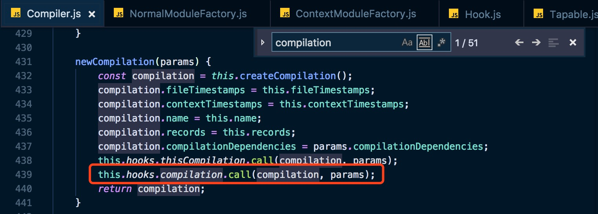
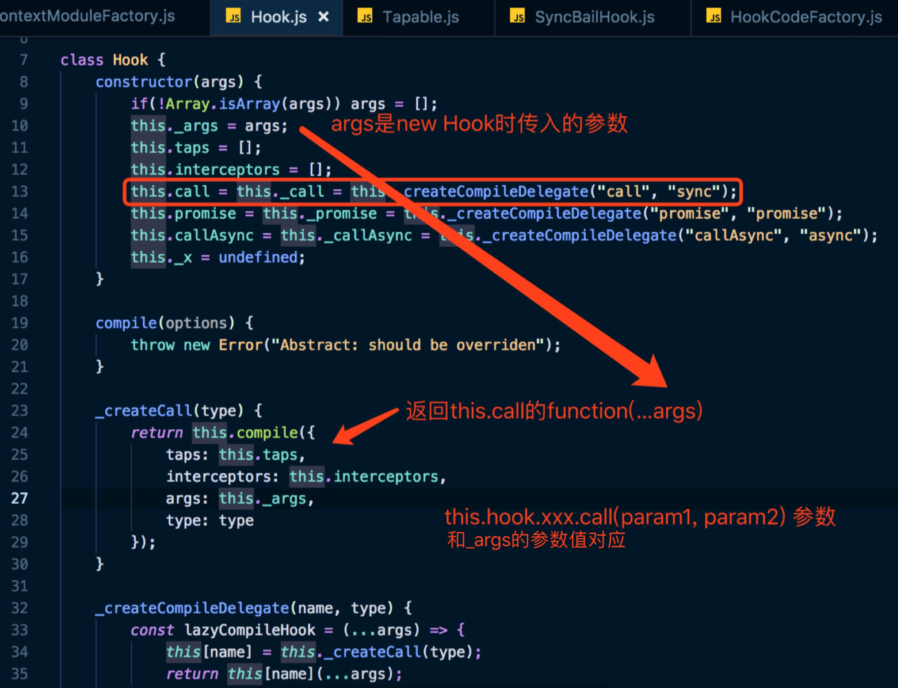
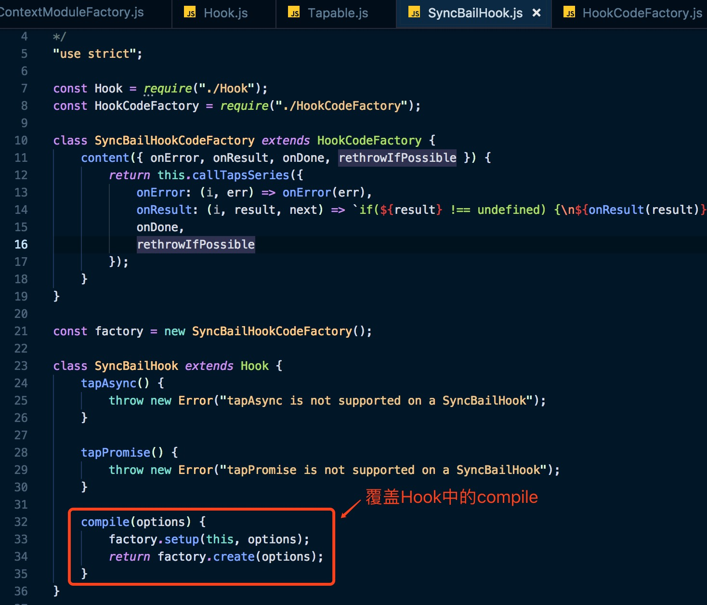
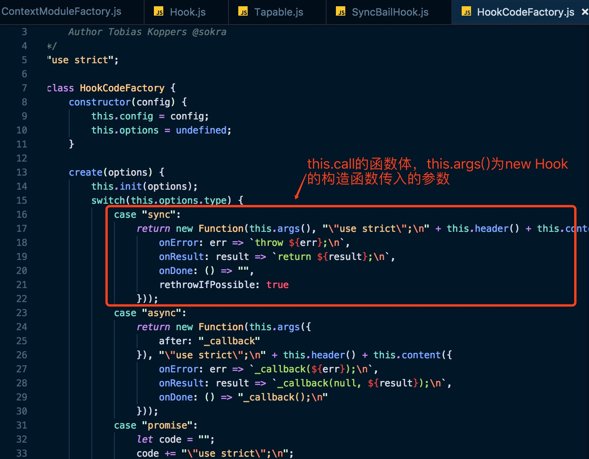
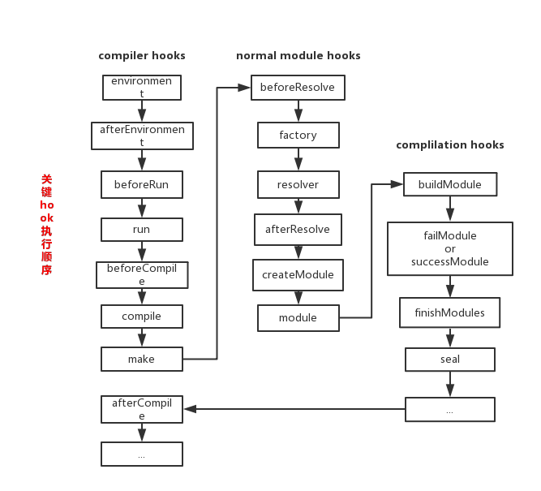
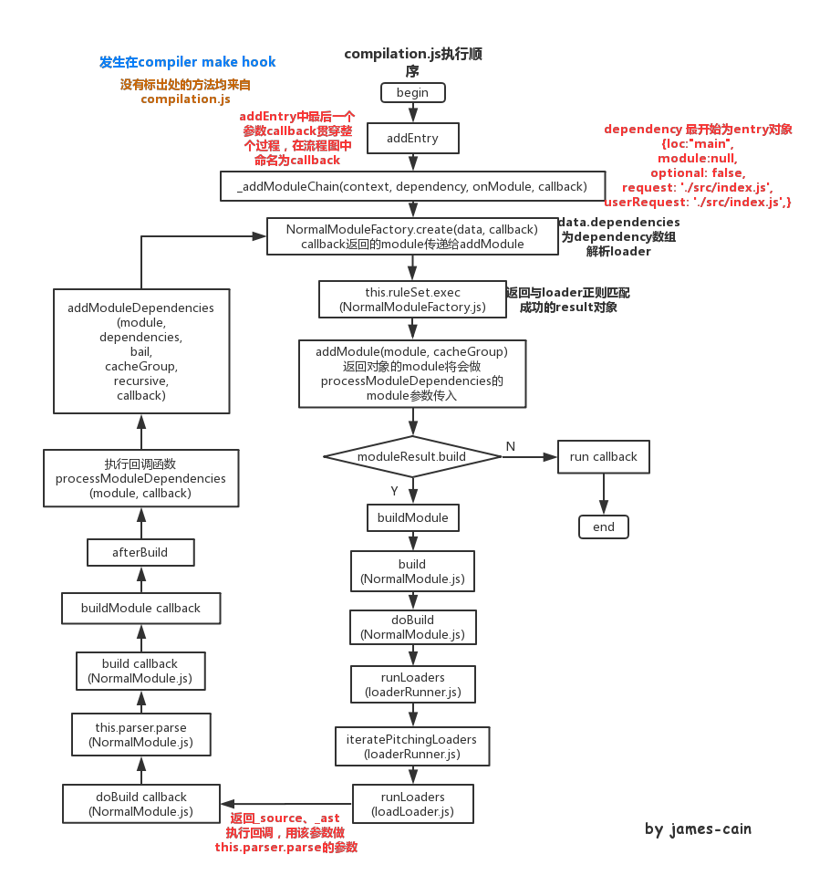

## webpack学习源码记录

1. 从核心入手，Tapable - (get)
2. 接下来详细阅读compiler，compilation两个继承类 - (get)
3. 学习如何编写plugin - (get)
4. 学习如何编写loader
5. 学习HMR原理
6. 理解bundle，如何生成chunks，需要理解AST、acorn  - (get)
7. 理解plugin执行原理  - (get)
8. 理解loader执行原理
9. 理解resolver是如何实现的，即如何查找对应文件所在的全路径
10. 对感兴趣的插件，loader学习源码
11. 动手写几个插件，loader
12. webpack更新速度惊人，跟着作者的步伐，尽量也能在源码中找到你的代码段

#### Webpack 源码调试

全局安装node-nightly

```
npm install --global node-nightly
```

安装完成后，执行

```
node-nightly
```

此时会下载nightly cli包，安装完成后才可以使用

接下来运行以下命令，Chrome Devtools会在chrome://inspect内产生可以断点调试的inspect链接

```
node-nightly --inspect-brk ./node_modules/webpack/bin/webpack.js
```

--inspect-brk 标记会自动给脚本第一句打断点，可以在源代码中设置断点调试

#### Webpack 4源码中的代码段理解图

##### compiler、compilation、hook


webpack.js 在最开始会new Compiler实例，创建compiler实例的hook，理解后面参数的含义，参数为hook执行call/callAsync/promise时，绑定的钩子的执行函数的参数，一一对应。也就是这里定义了几个变量，tap绑定的函数就可以传入几个参数



this.hooks.compilation.call(compilation, params)中的两个参数即为传入钩子函数的参数值



该代码段为Tapable的Hook.js，实际无论是compiler，compilation，resolver都是继承于Tapable，也就是都会执行这些方法，this.hooks.compilation.call即调用的就是`this.call = this._call = this.createCompileDelegate("call", "sync")`



Hook总共有10种类型，分为异步和同步两大类；异步包括并发执行和串行执行



create的返回值为函数方法，this.call(params)的执行方法

##### module.rules加载

```
// webpack.js compiler创建后都做了以下的事情 
// 创建compiler实例
compiler = new Compiler()
// 创建WebpackOptionsApply实例，挂在默认plugin hook
compiler.options = new WebpackOptionsApply().process(options, compiler)
	// WebpackOptionsApply.js 挂在各种plugin
    new EntryOptionPlugin().apply(compiler)
    	// EntryOptionPlugin.js 判断entry参数类型 挂不同类型plugin
        const SingleEntryPlugin = require()
        const MultiEntryPlugin = require()
        const DynamicEntryPlugin = require()
        	// 以SingleEntryPlugin.js为例
            compiler.hooks.make.tapAsync(
            	"SingleEntryPlugin", (compilation, callback) => {
                	…
                    compilation.addEntry(context, dep, name, callback)
                }
			)
```

###### hook执行顺序



> environment->afterEnvironment->beforeRun->run->beforeCompile->compile->make->...->buildModule（`compilation`）->failModule or successModule(`compilation`)->finishModules（`compilation`）->seal（`compilation`）->afterCompile
>
> hook执行顺序，make开始执行compilation 入口addEntry接口

###### compilation.js方法执行顺序



> addEntry->_addModuleChain->addModule[判断moduleResult.build === true]->buildModule->（`NormalModule.js`）build->（`NormalModule.js`）doBuild->（`loader-runner.js`）runLoaders（该方法会把上一个loader的结果或资源文件传入进去，并且该函数内还有一些方法，可以是loader改变为异步调用方式，或者获取query参数）->iteratePitchingLoaders(loader-runner.js)->processModuleDependencies->addModuleDependencies->addModule[判断moduleResult.build === true]->回到执行buildModule
>
> _addModuleChain和addModuleDependencies方法中 都调用了addModule函数生成新的moduleResult，若moduleResult.build === true,则会执行buildModule

###### addModule(module, cacheGroup)

*每次module的变化是怎么发生的？*

> 执行addModule后，返回的对象中的module会作为processModuleDependencies的参数传入，进行遍历

*执行style-loader，css-loader 为什么要遍历5遍？*

第一次module.request /Users/admin/repo/resourcecode/learning-webpack/src

第二次module.request /Users/admin/repo/resourcecode/learning-webpack/node_modules/style-loader/index.js!/Users/admin/repo/resourcecode/learning-webpack/node_modules/css-loader/index.js!/Users/admin/repo/resourcecode/learning-webpack/src/index.css

第三次module.request /Users/admin/repo/resourcecode/learning-webpack/node_modules/css-loader/index.js!/Users/admin/repo/resourcecode/learning-webpack/src/index.css

第四次module.request /Users/admin/repo/resourcecode/learning-webpack/node_modules/css-loader/lib/css-base.js

第五次module.request /Users/admin/repo/resourcecode/learning-webpack/node_modules/style-loader/lib/urls.js

```
build(options, compilation, resolver, fs, callback_build)
初始化_source _ast _buildHash为null
	doBuild(options, compilation, resolver, fs, callback_doBuild)
	执行runLoaders 返回	result{resourceBuffer,result.result[0] => source,sourceMap,extraInfo}
			执行createSource(source, resourceBuffer, sourceMap) 返回this._source
			赋值this._ast = extraInfo.webpackAST or null
			执行callback_doBuild
				this.parser.parse(this._ast || this._source.source(), …)
				执行callback_build
```

