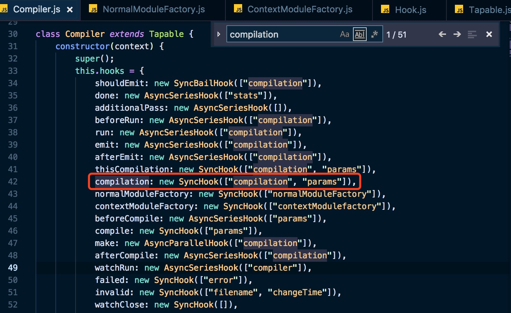
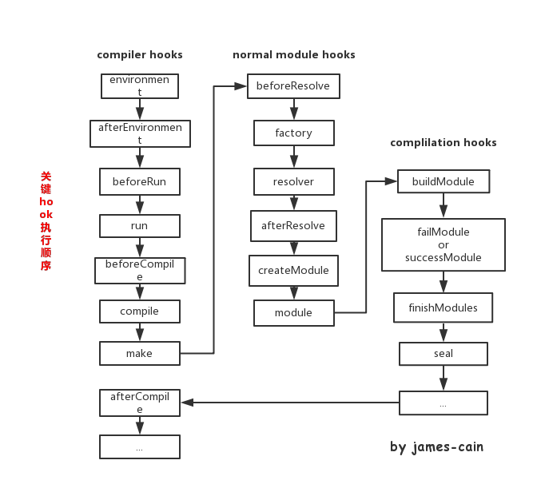
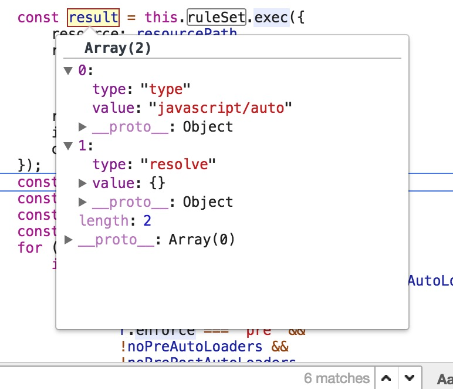
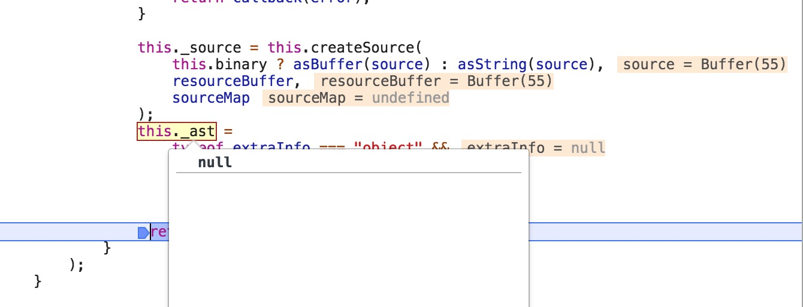
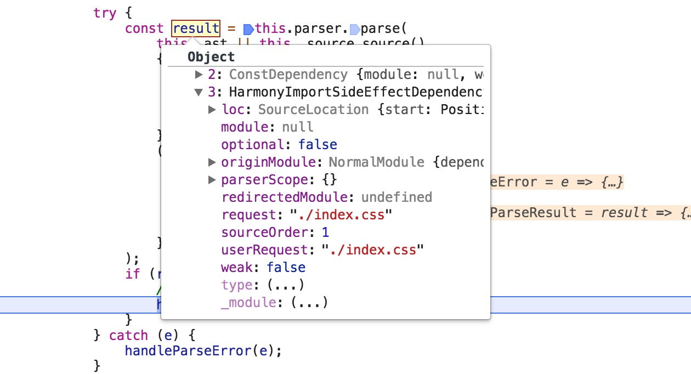
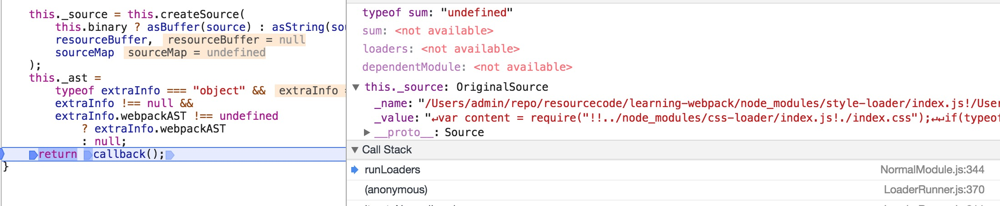
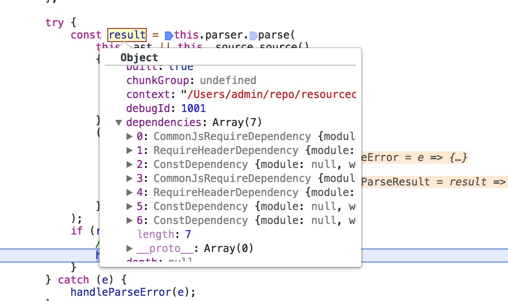
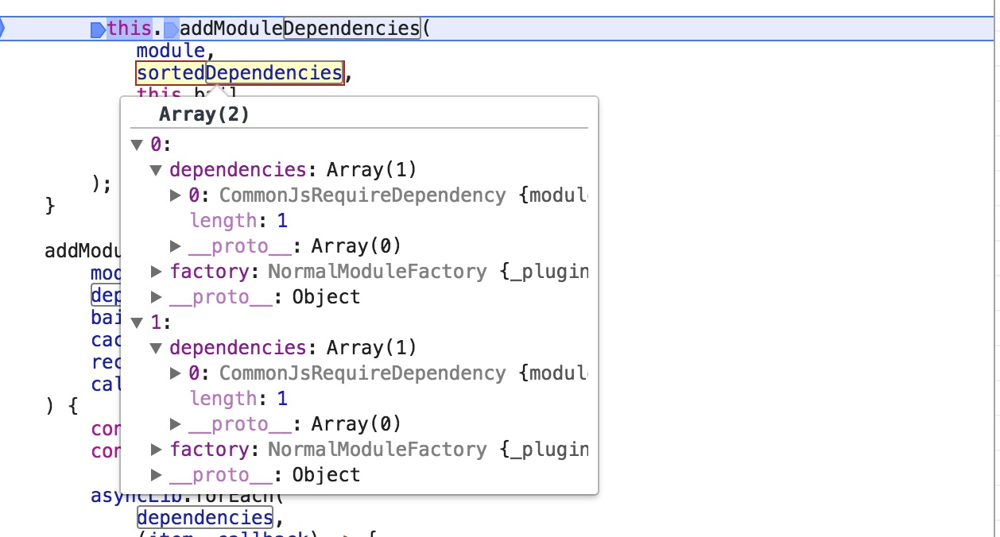

## webpack学习源码记录

1. 从核心入手，Tapable - (get)
2. 接下来详细阅读compiler，compilation两个继承类 - (get)
3. 学习如何编写plugin - (get)
4. 学习如何编写loader
5. 学习HMR原理
6. 理解bundle，如何生成chunks，需要理解AST、acorn  - (get)
7. 理解plugin执行原理  - (get)
8. 理解loader执行原理 - (get)
9. loader-runner运行机制
10. 理解resolver是如何实现的，即如何查找对应文件所在的全路径
11. 对感兴趣的插件，loader学习源码
12. 动手写几个插件，loader
13. webpack更新速度惊人，跟着作者的步伐，尽量也能在源码中找到你的代码段

#### Webpack 源码调试

全局安装node-nightly

```
npm install --global node-nightly
```

安装完成后，执行

```
node-nightly
```

此时会下载nightly cli包，安装完成后才可以使用

接下来运行以下命令，Chrome Devtools会在chrome://inspect内产生可以断点调试的inspect链接

```
node-nightly --inspect-brk ./node_modules/webpack/bin/webpack.js
```

--inspect-brk 标记会自动给脚本第一句打断点，可以在源代码中设置断点调试

#### Webpack 4源码中的代码段理解图

##### compiler、compilation、hook



webpack.js 在最开始会new Compiler实例，创建compiler实例的hook，理解后面参数的含义，参数为hook执行call/callAsync/promise时，绑定的钩子的执行函数的参数，一一对应。也就是这里定义了几个变量，tap绑定的函数就可以传入几个参数


this.hooks.compilation.call(compilation, params)中的两个参数即为传入钩子函数的参数值


该代码段为Tapable的Hook.js，实际无论是compiler，compilation，resolver都是继承于Tapable，也就是都会执行这些方法，this.hooks.compilation.call即调用的就是`this.call = this._call = this.createCompileDelegate("call", "sync")`


Hook总共有10种类型，分为异步和同步两大类；异步包括并发执行和串行执行


create的返回值为函数方法，this.call(params)的执行方法

##### module.rules加载

```
// webpack.js compiler创建后都做了以下的事情 
// 创建compiler实例
compiler = new Compiler()
// 创建WebpackOptionsApply实例，挂在默认plugin hook
compiler.options = new WebpackOptionsApply().process(options, compiler)
	// WebpackOptionsApply.js 挂在各种plugin
    new EntryOptionPlugin().apply(compiler)
    	// EntryOptionPlugin.js 判断entry参数类型 挂不同类型plugin
        const SingleEntryPlugin = require()
        const MultiEntryPlugin = require()
        const DynamicEntryPlugin = require()
        	// 以SingleEntryPlugin.js为例
            compiler.hooks.make.tapAsync(
            	"SingleEntryPlugin", (compilation, callback) => {
                	…
                    compilation.addEntry(context, dep, name, callback)
                }
			)
```

###### hook执行顺序



> environment->afterEnvironment->beforeRun->run->beforeCompile->compile->make->...->buildModule（`compilation`）->failModule or successModule(`compilation`)->finishModules（`compilation`）->seal（`compilation`）->afterCompile
>
> hook执行顺序，make开始执行compilation 入口addEntry接口

###### compilation.js方法执行顺序


> addEntry->_addModuleChain->addModule[判断moduleResult.build === true]->buildModule->（`NormalModule.js`）build->（`NormalModule.js`）doBuild->（`loader-runner.js`）runLoaders（该方法会把上一个loader的结果或资源文件传入进去，并且该函数内还有一些方法，可以是loader改变为异步调用方式，或者获取query参数）->iteratePitchingLoaders(loader-runner.js)->processModuleDependencies->addModuleDependencies->addModule[判断moduleResult.build === true]->回到执行buildModule
>
> _addModuleChain和addModuleDependencies方法中 都调用了addModule函数生成新的moduleResult，若moduleResult.build === true,则会执行buildModule

###### addModule(module, cacheGroup)

*每次module的变化是怎么发生的？*

> entry进入，通过create创建module，先去查找ruleSet规则是否有匹配，有则拼接链接，没有则不变；传入到runLoaders中获取处理后的_source、_ast，parser.parse处理_source、_ast返回还存在依赖的dependencies数组，将dependencies数组传入addModuleDependencies遍历，创建新的module。直到没有依赖的module，停止遍历，生成最终的bundle对象

*执行style-loader，css-loader 为什么要遍历5遍？*

第一次module.request /Users/admin/repo/resourcecode/learning-webpack/src

第二次module.request /Users/admin/repo/resourcecode/learning-webpack/node_modules/style-loader/index.js!/Users/admin/repo/resourcecode/learning-webpack/node_modules/css-loader/index.js!/Users/admin/repo/resourcecode/learning-webpack/src/index.css

第三次module.request /Users/admin/repo/resourcecode/learning-webpack/node_modules/css-loader/index.js!/Users/admin/repo/resourcecode/learning-webpack/src/index.css

第四次module.request /Users/admin/repo/resourcecode/learning-webpack/node_modules/css-loader/lib/css-base.js

第五次module.request /Users/admin/repo/resourcecode/learning-webpack/node_modules/style-loader/lib/urls.js

图解(只包含前两次)


执行第一次create，此时dependencies[0].request = './src/index.js'


ruleSet.exec() 解析路径是否有loader拦截



第一次解析只有返回默认的result




runLoaders解析index.js内容



parser.parse 生成ast树，解析树，将依赖对象存储在dependencies中


processModuleDependencies将dependencies中的依赖模块传入addModuleDependencies中，执行下一次的create


第二次create，传入的dependencies已经变为index.css


index.css被loader拦截，存在style-loader，css-loader两个拦截loader


此时request已经改为/Users/admin/repo/resourcecode/learning-webpack/node_modules/style-loader/index.js!/Users/admin/repo/resourcecode/learning-webpack/node_modules/css-loader/index.js!/Users/admin/repo/resourcecode/learning-webpack/src/index.css



runLoaders执行返回style-loader的代码段，赋给_source



经过parser.parse解析后，又多了好几个依赖



将依赖传给addModuleDependencies，进行接下来的create

> 经过图解，可以明白，第一次执行index.js，当解析源码遇到import 'index.css'，loader拦截，有两个style-loader和css-loader两个拦截加载器，接下来就是这两个拦截器的处理，但都是返回js代码，并解析；直到没有依赖结束，生成最终bundle。

###### build->doBuild->runLoaders执行函数

```
build(options, compilation, resolver, fs, callback_build)
初始化_source _ast _buildHash为null
	doBuild(options, compilation, resolver, fs, callback_doBuild)
	执行runLoaders 返回	result{resourceBuffer,result.result[0] => source,sourceMap,extraInfo}
			执行createSource(source, resourceBuffer, sourceMap) 返回this._source
			赋值this._ast = extraInfo.webpackAST or null
			执行callback_doBuild
				this.parser.parse(this._ast || this._source.source(), …)
				执行callback_build
```

###### 理解 loader-runner

> 传入resource，context，loaders，readResource，实现同步/异步loader解析
>
> 在loader中设置raw(true/false[default])，可以实现资源以Buffer or String形式传递
>
> 在loader中设置pitch，并在pitch中return返回值，可以跳过接下来会调用的loader，pitch调用方式从左到右，loader实际执行方式从右到左

同步loader

异步loader

Raw loader处理结果方式String or Buffer

pitch

```
loader总是从右到左被调用，如果前一个loader的结果不关注，想忽略该结果。可以使用pitch方法，该方法从左往右调用
要在你的loader中实现pitch接口，如style-loader

module.exports.pitch = function (request) {
	if (this.cacheable) this.cacheable();

	var options = loaderUtils.getOptions(this) || {};

	validateOptions(require('./options.json'), options, 'Style Loader')
	...
}

若在pitch中return结果，将提前终止loader的遍历
例如
use: [
  'a-loader',
  'b-loader',
  'c-loader'
]

正常情况
|- a-loader `pitch`
  |- b-loader `pitch`
    |- c-loader `pitch`
      |- requested module is picked up as a dependency
    |- c-loader normal execution
  |- b-loader normal execution
|- a-loader normal execution

若a-loader在pitch中return
|- a-loader `pitch`
  |- b-loader `pitch` returns a module
|- a-loader normal execution
```

!!、！含义

```
所有普通 loader 可以通过在请求中加上 ! 前缀来忽略（覆盖）。
所有普通和前置 loader 可以通过在请求中加上 -! 前缀来忽略（覆盖）。
所有普通，后置和前置 loader 可以通过在请求中加上 !! 前缀来忽略（覆盖）。
不应该使用行内 loader 和 ! 前缀，因为它们是非标准的。它们可在由 loader 生成的代码中使用。
```

